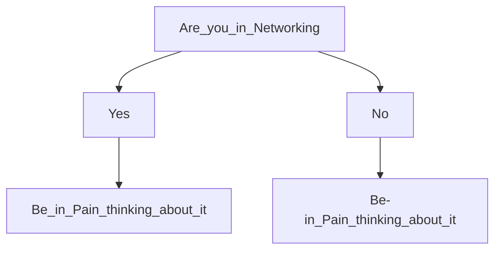
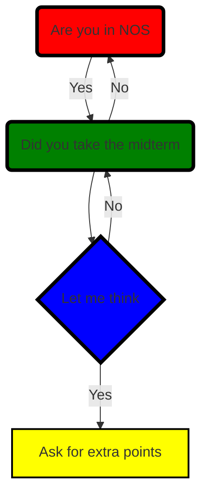

# H1 About Me
## H2 My Interests
* **Video Games**
* _Sleeping_

### H3 Games I recomend
* Zelda
* Minecraft
* Fortnight
* ~~Overwatch~~ Old Overwatch
* Sedoku

### Teachers (Not in Order except for #1)
1. Mr. Garder
2. Mr. Helm
3. Ms. Cary
4. Dr. Kaulfuss
5. Ms. Blackwell
6. Ms. Keller
7. Mr. Alston
8. Ms. Whittington
9. Ms. Herra
10. Mr. Murphy

### 10 Things to Do
- [x] Want school to end
- [x] Watch Openhimer
- [x] Be tired
- [] Face Reality
- [x] Have a Job
- [x] Annoy Biruk
- [] Get this Assignment Done
- [] Live
- [] Become Rich
- [] Say "Hello" to a Freshman

### Sites I Recommend
- [Google](https://google.com/) - It's Google it helps with almost everything in a way. I use it to get information.
- [Youtube](https://youtube.com/) - It has videos to watch. I watch the videos it has.
- [Coolmathgames](https://coolmathgames.com/) - You can never go wrong with it. I used it because I was thinking about games to play after finishing my assignments.

